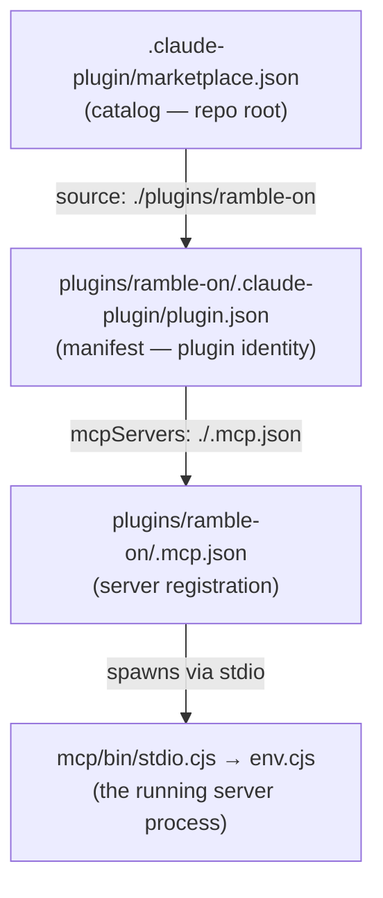

# MCP Architecture — quantum-harmony marketplace

How an MCP tool call becomes possible in this repo: every JSON object between
"user adds the marketplace" and "Claude calls `ramble.translate`", what each
one owns, and where each value is resolved.

All examples reference the one plugin here that bundles an MCP server:
[`plugins/ramble-on/`](../plugins/ramble-on/).

## The four layers



Each layer is parsed by a different consumer, at a different time:

| Layer | File | Parsed by | When |
|---|---|---|---|
| Catalog | `.claude-plugin/marketplace.json` | Claude Code | `/plugin marketplace add` |
| Manifest | `<plugin>/.claude-plugin/plugin.json` | Claude Code | `/plugin install` + every load |
| Registration | `<plugin>/.mcp.json` | Claude Code | plugin enable |
| Process | `mcp/env.cjs` (via `stdio.cjs`) | the server itself | process start |

A failure at any layer takes out everything below it — and a syntax error in
the catalog takes out **every plugin in the marketplace**, not just one.

---

## Layer 1 — the marketplace catalog

`.claude-plugin/marketplace.json` at the repo root. Two kinds of objects live
here.

### The root object

```json
{
  "name": "quantum-harmony",
  "owner": { "name": "Quantum Harmony LLC", "email": "prinston@artemiscity.com" },
  "plugins": [ ... ]
}
```

- **`name`** — the marketplace's identity. Users see it in `/plugin marketplace list`.
- **`owner`** — attribution for the catalog as a whole (distinct from each plugin's `author`).
- **`plugins`** — the array of plugin entries below.

### The plugin entry object

```json
{
  "name": "ramble-on",
  "source": "./plugins/ramble-on",
  "description": "Signal translation layer for fast, non-linear thinkers.",
  "version": "1.1.0",
  "author": { "name": "Quantum Harmony LLC" },
  "license": "Apache-2.0"
}
```

- **`name`** — what the user types in `/plugin install <name>`. Must match the
  plugin manifest's `name` (kebab-case). A mismatch means the README's install
  command silently targets a nonexistent entry.
- **`source`** — where the plugin lives, relative to the repo root. This is the
  *only* link between catalog and manifest; nothing else is inferred.
- **`description`** — a short, single-line pitch for the catalog listing. This
  is **not** the place for skill-trigger prose ("Use this skill whenever…") —
  that text belongs in the skill's `SKILL.md` frontmatter, where the model
  reads it to decide when to activate. Two different consumers, two different
  texts.
- **`version` / `author` / `license`** — display metadata. Keep `version` in
  lockstep with the manifest's; drift here means the catalog advertises a
  release that isn't what installs.

> JSON constraint that bit this repo once: strings must be single-line with
> escaped inner quotes, and no trailing commas. `claude plugin validate .`
> checks the catalog before you push.

---

## Layer 2 — the plugin manifest

`plugins/ramble-on/.claude-plugin/plugin.json`. This is the plugin's identity
card, read on every load.

```json
{
  "name": "ramble-on",
  "version": "1.1.0",
  "description": "Signal translation layer …",
  "author": { "name": "Quantum Harmony LLC", "email": "prinston@artemiscity.com" },
  "license": "Apache-2.0",
  "mcpServers": "./.mcp.json"
}
```

- **`name`** — canonical plugin name. Becomes part of every MCP tool's full
  name (see Layer 4), so renaming a plugin renames its tools.
- **`mcpServers`** — either a **path string** pointing at a registration file
  (as here) or an **inline object** with the same shape as `.mcp.json`'s
  contents. A `.mcp.json` at the plugin root is also auto-discovered with no
  manifest field at all — so this pointer is belt-and-braces. Pick one
  convention and keep it consistent across plugins.

The presence of `.claude-plugin/plugin.json` is what *makes* a directory a
plugin. That's why stray copies of this file (e.g. at the `plugins/` container
level) are dangerous: they turn a directory that has no `mcp/` tree into
something Claude Code will try to treat as an installable plugin.

---

## Layer 3 — the server registration

`plugins/ramble-on/.mcp.json`. One object per server the plugin bundles.

```json
{
  "mcpServers": {
    "ramble-on": {
      "command": "node",
      "args": ["${CLAUDE_PLUGIN_ROOT}/mcp/bin/stdio.cjs"],
      "env": {
        "NOTION_API_KEY": "${NOTION_API_KEY}",
        "GEMINI_API_KEY": "${GEMINI_API_KEY}",
        "AI_PROVIDER": "${AI_PROVIDER:-}",
        "RAMBLE_NOTION_ROOT": "${RAMBLE_NOTION_ROOT:-}"
      }
    }
  }
}
```

### The server object, field by field

- **key (`"ramble-on"`)** — the *server name*. Independent of the plugin name,
  though here they coincide. Also baked into tool names.
- **`command` + `args`** — how to spawn the process. This is a **stdio**
  server: Claude Code launches it as a child process and speaks MCP over
  stdin/stdout. The alternatives (`"type": "sse"`, `"http"`, `"ws"` with a
  `url`) are for hosted servers — not needed when the server ships inside the
  plugin.
- **`env`** — variables injected into the child process. Each value supports
  expansion (below).

### Variable expansion — the three forms

| Form | Resolves to | Use for |
|---|---|---|
| `${CLAUDE_PLUGIN_ROOT}` | absolute path of the *installed* plugin | every file path — the install location is not the repo checkout |
| `${VAR}` | the user's environment variable | **required** secrets — fail loudly if missing |
| `${VAR:-default}` | the variable, or `default` if unset | **optional** knobs — degrade silently |

The bare/`:-` distinction is a design statement, not a syntax detail:
`${NOTION_API_KEY}` says "this plugin is broken without it";
`${AI_PROVIDER:-}` says "the server has its own default, pass through
whatever's there."

---

## Layer 4 — the running server

`mcp/bin/stdio.cjs` boots the server; `mcp/env.cjs` is the **last resolution
layer** — it decides what the injected environment actually *means*:

- `AI_PROVIDER` → `normalizeProvider()` maps anything that isn't
  `openai`/`anthropic` (including empty) to **`gemini`**. This is why
  `${AI_PROVIDER:-}` is safe in Layer 3: the default lives in code, not config.
- `RAMBLE_NOTION_ROOT` → falls back to a hardcoded root page ID in `CONFIG.notion.rootPage`.
- `NOTION_API_KEY` → `requireNotionToken()` **throws** when missing. The
  required/optional split declared in `.mcp.json` is mirrored — and actually
  enforced — here.
- `env.cjs` also reads `.env.local` from the working directory as a bottom
  fallback, filling only variables the environment didn't already set.

Once the process is up, Claude Code performs MCP tool discovery and registers
each tool under a fully qualified name:

```
mcp__plugin_<plugin-name>_<server-name>__<tool-name>
         ramble-on     ramble-on      ramble.translate
```

Those names are what a skill or command pre-allows in `allowed-tools`
frontmatter — allow the specific tools a workflow needs, not the `__*`
wildcard.

### Lifecycle

1. Plugin enabled → registration parsed, variables expanded
2. Process spawned (`node …/mcp/bin/stdio.cjs`) with the injected `env`
3. `env.cjs` loads `.env.local` fallbacks, normalizes providers
4. Tool discovery over stdio → tools registered with prefixed names
5. Process terminated when Claude Code exits; config changes need a restart

---

## Design principle: defaults belong in code, requirements in config

The recurring pattern across these layers: each optional value has exactly one
owner of its default (`env.cjs`), and each required value fails at the
earliest layer that can detect it. When editing any of these files, ask:
*which layer owns this value, and which layer catches its absence?* If two
layers both try to own a default, they will eventually disagree.